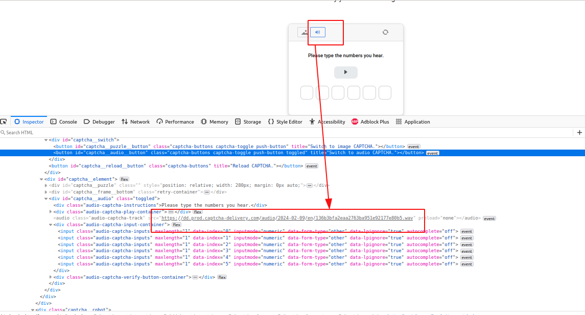

# Simple API to solve (transcribe) captcha audio using Whisper

Just a simple API to solve audio captcha using Whisper (transcription)


I used the smaller model from Whisper in several proof of concepts, and it was enough





## Usage

1. Install dependencies, see [requirements.txt](requirements.txt)
2. Start API
```python
python run.py
```
2. Send url, e.g:
```python
curl -X 'POST' \
  'http://0.0.0.0:8000/captcha/text' \
  -H 'accept: application/json' \
  -H 'Content-Type: application/json' \
  -d '{
  "url": "https://dd.prod.captcha-delivery.com/audio/2024-02-09/en/136b3bfa2eaa2763ba951e92177e80b5.wav"
}'
```
Response:
```json
{
  "text": "Please type the numbers you hear. 7. 5. 1. 8. 8. 9.",
  "elapsed": 3.88
}
```
3. Process text in your scraper/robot, whatever
